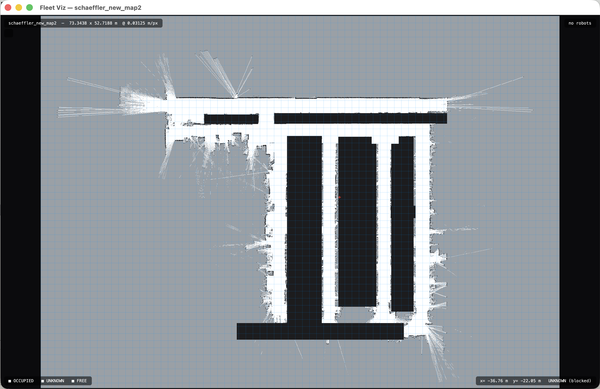
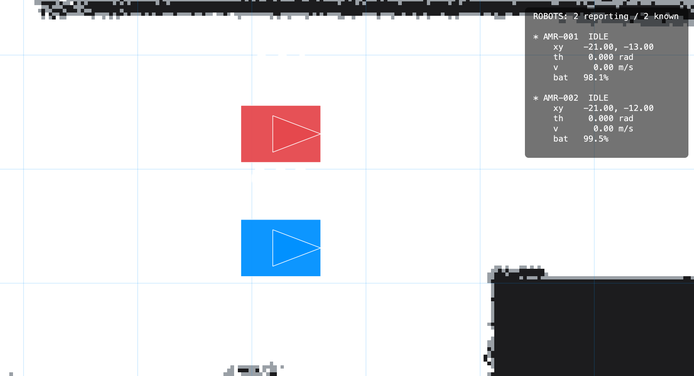

# 로봇 클라이언트 매뉴얼

다중 AMR FMS 프로젝트의 **로봇 클라이언트** 문서다. FMS 서버 쪽은 다루지 않는다.

실물 로봇이 아직 없으므로, 이 프로그램이 그 자리를 대신한다. 밖에서 보면 MQTT 로
`state` 를 보고하고 `order` 를 받는 로봇 한 대이고, 안에서는 운동학·배터리를
시뮬레이션한다. **FMS 는 이 프로세스 안을 들여다보지 않는다** — 시뮬레이터인지
실물인지 구분할 수 없어야 한다는 게 프로젝트의 핵심 원칙이다.

---

## 1. 개요

### 프로세스 모델

**로봇 1대 = 프로세스 1개.** 한 프로세스에 여러 대를 넣지 않는다. 10대를 띄우려면
10번 실행한다.

```bash
python -m robot_client.main --id AMR-001 --map maps/warehouse/warehouse.json --x 1.2 --y 6.0
python -m robot_client.main --id AMR-002 --map maps/warehouse/warehouse.json --x 1.2 --y 4.0
```

이 구조 덕에 장애 주입이 `kill -9` / `docker stop` 으로 끝난다 — 프로세스가 죽으면
브로커가 LWT 로 `CONNECTION_BROKEN` 을 대신 발행한다. 대신 전역 시계를 공유할 수
없어 가속 시뮬레이션은 불가능하고 실시간 모드로만 돈다.

### 외부 인터페이스

```
                  ┌─────────────────────────────┐
   order   ──────>│                             │
   instant ──────>│      robot_client.main      │────> state(200ms)
                  │                             │────> connection(retain)
                  └─────────────────────────────┘
                            │            ▲
                         커맨드 큐      직접 읽기
                            ▼            │
                  ┌─────────────────────────────┐
                  │       로컬제어판(gui)          │  ← MQTT 안 탐
                  └─────────────────────────────┘
```

MQTT 토픽은 자기 것만 쓰고 읽는다.

| 토픽 | 방향 | QoS | 비고 |
|---|---|---|---|
| `fms/v1/{id}/connection` | Robot → FMS | 1 | retain, LWT |
| `fms/v1/{id}/state` | Robot → FMS | 0 | 200ms 주기. 유실돼도 다음 게 온다 |
| `fms/v1/{id}/order` | FMS → Robot | 1 | 구독 |
| `fms/v1/{id}/instant` | FMS → Robot | 1 | 구독 |

---

## 2. 실행

### CLI 옵션

```bash
python -m robot_client.main --id AMR-001 [옵션]
```

| 옵션 | 기본값 | 설명 |
|---|---|---|
| `--id` | (필수) | 로봇 식별자. MQTT 토픽에 들어간다 |
| `--host` / `--port` | `localhost` / `1883` | MQTT 브로커 |
| `--x` / `--y` / `--theta` | `0` / `0` / `0` | 시작 pose (m, m, rad) |
| `--map` | 없음 | 맵 메타데이터 JSON. **주면 경로계획 + 충돌 감지가 켜진다** |
| `--robot-width` / `--robot-length` | `0.5` / `0.7` | 로봇 크기 (m). 경로계획 팽창에 쓰임 |
| `--max-velocity` | `1.2` | 최대 속도 (m/s) |
| `--max-acceleration` | `0.6` | 최대 가속도 (m/s²). 감속도도 같은 값 |
| `--battery` | `100.0` | 시작 배터리 (%) |
| `--seed` | 없음 | 속도 노이즈 시드. 실험 재현에 필요 |
| `--speed-noise` | `0.05` | 최대 속도 상대 노이즈 (±5%) |
| `--log-level` | `INFO` | `DEBUG` / `INFO` / `WARNING` |
| `--gui` | 꺼짐 | 로컬 제어판(Tk) 창을 띄운다 |

`--map` 을 **안 주면** 경로계획도 충돌 감지도 꺼지고, 오더 노드 사이를 직선으로만
움직인다 (개발 초기 호환용). 주면 시작 위치가 주행 가능 셀인지 확인하고, 아니면
에러 로그를 남기고 종료한다.

`--seed` 와 `--id` 를 함께 해싱하므로, **같은 시드 + 같은 ID = 항상 같은 노이즈**다.
속도 노이즈를 기본으로 켜 두는 이유는 로봇들이 완벽 동기화되면 충돌 상황 자체가
재현되지 않기 때문이다.

### 종료

`SIGINT`/`SIGTERM` 을 받으면 ticker 를 멈추고 `OFFLINE` 을 retain 으로 남기고 끊는다
(정상 종료라 LWT 는 발행되지 않는다). 강제 종료(`kill -9`)면 브로커가 LWT 로
`CONNECTION_BROKEN` 을 대신 발행한다 — 둘의 구분이 장애 감지의 근거다.

---

## 3. 구조

```
robot_client/
├── main.py         CLI 진입점, tick 루프, GUI 커맨드 디스패치
├── comm.py         MQTT 송수신, LWT, 수신 큐
├── executor.py     오더 상태머신 (이 프로그램의 심장)
├── planner.py      A* 경로계획 (로봇 폭 반영 config-space 팽창)
├── gui.py          로컬 제어판 (Tk, --gui 일 때만 import)
├── clock.py        시계 추상화 (Clock / RealtimeClock / Ticker)
└── sim/            ⚠️ FMS·뷰어에서 절대 import 금지
    ├── kinematics.py   사다리꼴 속도 프로파일
    └── battery.py      선형 방전/충전
```

### 모듈별 책임

**`main.py`** — 인자 파싱, 객체 조립, 20Hz tick 루프. 루프 한 바퀴는
`comm.drain()` (수신 처리) → GUI 커맨드 큐 처리 → `executor.tick(dt)` →
200ms 마다 `comm.publish_state()` 순이다.

**`comm.py`** — paho-mqtt 래퍼. 수신 콜백은 **네트워크 스레드**에서 실행되므로
거기서 상태를 직접 건드리지 않고 파싱만 해서 큐에 넣는다. 실제 처리는 메인 루프가
`drain()` 으로 꺼내서 한다 — **락 없이 단일 스레드 상태머신을 유지하기 위한 구조**다.
검증 실패한 메시지는 버리고 로그만 남긴다 (반쯤 해석한 오더를 실행하는 것보다 안전).

`rebind_id()` 는 GUI 에서 로봇 ID 를 바꿀 때 쓴다. LWT 는 CONNECT 패킷에 실려야
브로커에 등록되므로 이미 붙은 세션의 will 을 덮어쓸 수 없다 — 옛 세션을 `OFFLINE`
으로 정리하고 새 client_id/LWT 로 통째로 재접속한다.

**`executor.py`** — 오더 상태머신. 운동학·배터리를 소유하고, 매 tick 마다
`State` 스냅샷을 만든다. 4장에서 자세히 다룬다.

**`planner.py`** — grid A*. 장애물을 `robot_width/2` 만큼 부풀린 config-space 위에서
돌리므로 **로봇 폭보다 좁은 통로는 애초에 경로가 안 나온다**. 8방향 이동에 코너 컷팅
방지, 찾은 뒤 line-of-sight 로 꺾이는 점만 남긴다 (격자 계단현상 제거). 팽창 격자는
`(맵 id, 반경)` 키로 캐시한다 — 맵은 런타임에 안 바뀐다고 가정.

시작/목적지 칸이 벽에 붙어 팽창 때문에 막힌 것으로 잡히면 **그 두 칸만 예외로**
통행 가능 취급한다. 팽창은 "지나가는 길" 폭을 보장하는 것이지 정지 지점까지 막을
이유는 없다 (도킹 지점처럼 벽에 붙은 목적지가 실제로 있다).

**`clock.py`** — 로봇 코드가 `time.sleep()` 을 직접 부르지 않게 한 겹 감쌌다.
`Ticker` 는 다음 깨어날 시각 기준으로 대기해 누적 오차를 막고, 한참 밀리면
따라잡기를 포기하고 기준을 다시 잡는다 (spiral of death 방지).

**`sim/kinematics.py`** — 등가속/등감속 사다리꼴 프로파일. 남은 **전체** 경로 길이
기준으로 가감속을 계산하므로 경유점마다 멈추지 않고 경로 끝에서만 정지한다.
코너링은 순간 처리 — `theta` 는 현재 구간 방향으로 즉시 갱신된다.
실물 센서가 없으므로 로컬라이징을 구현하지 않는다. 시뮬레이션 값이 곧 ground truth 다.

**`sim/battery.py`** — `소모율(%/s) = idle_drain + move_drain × (속도/최대속도)`.
충전 중이면 속도를 무시하고 `charge_rate` 로 채운다 (전원선이 꽂혀 있으므로
e-stop/pause 중에도 계속 충전된다).

### 스레드 모델

| 스레드 | 하는 일 |
|---|---|
| paho 네트워크 | MQTT 수신 → 파싱 → 큐에 넣기만 |
| tick 루프 | 큐 drain, 상태머신 tick, state 발행. **상태를 건드리는 유일한 스레드** |
| Tk 메인 | (`--gui` 일 때) 제어판. 명령은 큐에 넣고, 표시값은 executor 를 직접 읽음 |

`--gui` 를 주면 Tk 가 메인 스레드를 차지하고 (특히 macOS 에서 필수) tick 루프가
백그라운드 데몬 스레드로 간다. GUI 가 executor 를 락 없이 직접 읽는 건 표시 전용이고
0.2초마다 갱신되기 때문이다 — 값이 드물게 어긋나 보여도 다음 틱에 정정된다.

---

## 4. 상태

### 축이 네 개다

하나의 enum 에 뭉치지 않는다. 뭉치면 "BUSY 인데 PAUSE", "IDLE 인데 MANUAL" 같은
실제로 발생하는 조합을 표현할 수 없다.

```
state       IDLE | BUSY | CHARGING | ERROR | EMERGENCY     배타적
sub_state   MOVING | WAITING | ACTING                      state == BUSY 일 때만
mode        AUTO | MANUAL                                  패널 토글 스위치
paused      bool + pause_source(LOCAL | FMS)               start 버튼 / FMS PAUSE
```

**`OFFLINE` 은 `state` 값이 아니다.** 전원이 꺼진 로봇은 자기가 OFFLINE 이라고
발행할 수 없다 — `connection` 토픽에서 브로커가 LWT 로 대신 알린다.

`WAITING` 을 BUSY 안에 묻지 않은 이유: 트래픽 제어의 데드락 감지는 "A 가 B 를
기다리고 B 가 A 를 기다린다" 를 봐야 하는데, BUSY 만 봐서는 주행 중인지 통행권
대기인지 구분할 수 없다.

### 상태 전이

```
IDLE ─(order)→ BUSY/MOVING ─(도착)→ BUSY/ACTING ─(완료)→ BUSY/MOVING ...
                    │                                   └→ IDLE
                    ├─(released:false)→ BUSY/WAITING
                    └─(CHARGE 액션)───→ CHARGING ─(완료)→ IDLE
ERROR      어느 상태에서든 진입. FATAL 이면 오더를 버린다
EMERGENCY  e-stop 래치가 눌린 동안 위 상태를 덮어써서 보고
```

### 두 개의 술어

상태를 세는 대신 조건식으로 판단한다.

**주행 억제** (`OrderExecutor.motion_inhibited`) — 넷 중 하나라도 참이면 안 움직인다.
**job 은 유지된다.**

```
state == EMERGENCY  or  state == ERROR  or  paused  or  mode == MANUAL
```

**job 수락** (`OrderExecutor.can_accept_job` / `State.is_available`)

```
state == IDLE and mode == AUTO and not paused
  and order_id is None and errors 에 FATAL 없음
```

### EMERGENCY 와 PAUSE 는 base state 를 건드리지 않는다

내부적으로 `base_state`(IDLE/BUSY/CHARGING/ERROR)를 그대로 들고 있고, `state`
프로퍼티가 래치가 눌린 동안 EMERGENCY 를 덮어씌워 보고한다.

```python
@property
def state(self) -> RobotState:
    if self.estop_latched:
        return RobotState.EMERGENCY
    return self.base_state
```

그래서 **"풀면 원래 상태로 복귀" 에 저장/복원 로직이 아예 없다** — 애초에 안
바꿨으니 그냥 그대로다. 이게 상태 desync 버그를 한 부류 통째로 없앤다.

```
IDLE ─(e-stop)→ EMERGENCY ─(래치 해제)→ IDLE
BUSY ─(e-stop)→ EMERGENCY ─(래치 해제)→ BUSY  (하던 job 이어서)
```

단, 정지 지점이 노드 사이일 수 있으므로 풀릴 때 `_resume_motion()` 이 **현재 위치
기준으로 A\* 를 다시 돌린다**. MANUAL 도 마찬가지 — 사람이 로봇을 딴 데로 몰고 갔을
수 있으니 AUTO 복귀 시 경로를 새로 짠다.

EMERGENCY 는 `errors[]` 에 FATAL 로 들어가지 않는다. 넣으면 "FATAL 이면 오더를 버린다"
규칙을 타서 job 이 사라진다.

**ERROR 는 다르다.** FATAL 은 오더를 버리고, start 버튼이나 FMS 의 `RESET_ERROR` 로
풀어야 IDLE 로 돌아간다. 재배정은 FMS 몫이다.

### 보고할 때의 sub_state

`sub_state` 는 `state == BUSY` 일 때만 값을 가진다 (스키마가 검증한다). e-stop 으로
EMERGENCY 를 보고하는 동안에는 비운다 — 무엇을 하던 중이었는지는 `order_id` 와
`node_states` 에 그대로 남아 있다.

---

## 5. 물리 패널


실물 로봇 몸체에 붙은 버튼들. `--gui` 제어판이 그대로 재현한다.

| 버튼 | 동작 |
|---|---|
| **start** | 우선순위 고정: `e-stop 눌림 → 무시` / `ERROR → 오류 해제` / `paused → 해제` / `그 외 → paused 설정(LOCAL)` |
| **stop** | 기능 없음 (더미). 실물 패널에 있어서 재현만 |
| **emergency** | 래치형. 누르면 눌린 채 유지, 다시 눌러야 해제. 즉시 정지, job 유지 |
| **auto/manual** | MANUAL 이면 job 안 받고 주행 정지. AUTO 복귀 시 재계획 후 이어서 |

start 버튼 하나가 세 가지 일을 하므로 순서가 고정돼 있다. `press_start()` 는 무엇을
했는지 문자열로 돌려준다 (제어판 표시용).

### pause 는 출처를 기억한다 — 로컬이 상위

| 건 주체 | `pause_source` | FMS 가 해제 | 로컬 제어판이 해제 |
|---|---|---|---|
| start 버튼 / 제어판 | `LOCAL` | ✗ | ✓ |
| FMS 의 `PAUSE` 즉시명령 | `FMS` | ✓ | ✓ |

사람이 손으로 세운 로봇을 원격에서 푸는 건 막는다. 물리 e-stop 은 아예 원격 제어
대상이 아니다 — 그래서 `InstantActionType` 에 e-stop 이 없고 `PAUSE` 만 있다.

---

## 6. 오더 처리

### 경로계획은 로봇 몫이다

> **FMS 는 목적지 좌표만 오더로 준다.** 거기까지 장애물 피해서 가는 길은 로봇이
> 자기 맵으로 스스로 A\* 를 돌려서 짠다.

오더 노드는 보통 1개(목적지)다. `released`/트래픽 제어 개념 자체는 그대로다 — FMS 는
여전히 어느 노드까지 통행권을 줄지 결정하고, 그 노드 사이를 "어떻게" 갈지만 로봇이
정한다. 계획한 경로는 `State.local_path` 로 되돌려 보고한다 (관측용이며, 아무도 이걸
입력으로 쓰지 않는다).

### released — 트래픽 제어의 실행 수단

정지 명령이 아니라 **통행권 부여**로 구현한다.

- FMS 는 안전이 확보된 노드만 `released: true` 로 내려보낸다
- 로봇은 `released: false` 노드 **직전에서 스스로 멈추고** `BUSY/WAITING` 이 된다
- 통행권이 생기면 FMS 가 `order_update_id` 를 올려 같은 오더를 재발행
- **메시지가 유실돼도 로봇은 안전한 쪽(정지)에 머무른다**
- 스키마가 "released 는 앞에서부터 연속으로 true" 를 검증하므로, 처음 나오는 false
  이후는 전부 false 다

주행 구간(segment)은 `current_index` 부터 다음 둘 중 먼저 오는 데까지 잡는다.

1. `released=false` 노드를 만나거나
2. `action` 이 있는 노드에 도달하면 (거기서 멈춰야 하므로)

그 사이 노드들은 감속 없이 통과한다.

### 오더를 거절하는 경우

**FMS 를 만들 때 이 규칙을 알고 있어야 한다.** 로봇은 다음을 조용히 무시한다.

| 조건 | 이유 |
|---|---|
| 같은 `order_id` 인데 `order_update_id` 가 크지 않음 | 통행권을 되돌리지 않기 위해 |
| 이미 완료한 오더의 재전송 | QoS 1 중복·FMS 재시작 시 재실행 방지 |
| `state != IDLE` (BUSY/CHARGING/ERROR/EMERGENCY) | 오더는 한 번에 하나 |
| `mode == MANUAL` | 사람이 조이스틱으로 몰고 있다 |
| `paused == True` | 세워둔 로봇에 일을 주지 않는다 |

**예외: 같은 `order_id` 의 갱신은 정지 중에도 받는다.** e-stop/pause/MANUAL 로 서
있어도 `order_update_id` 를 올린 재발행은 수용한다 — 안 그러면 로봇이 정지한 사이
트래픽 통행권을 열어줄 수 없다. 받아만 두고 실제 주행은 억제가 풀린 뒤에 한다.

완료한 오더는 `order_id` 를 비우기 때문에, `_last_completed` 로 `(order_id,
order_update_id)` 를 따로 기억해 둔다. 없으면 QoS 1 재전송이나 FMS 재시작으로 같은
오더가 다시 왔을 때 처음부터 또 실행한다.

### 즉시 명령 (`instant`)

| 명령 | 동작 |
|---|---|
| `CANCEL_ORDER` | 오더를 버리고 IDLE |
| `PAUSE` | `pause_source=FMS` 로 일시정지. job 유지 |
| `RESUME` | FMS 가 건 pause 만 풀 수 있다 (LOCAL 은 못 푼다) |
| `RESET_ERROR` | 오류 초기화. ERROR 였으면 IDLE 로 |
| `INJECT_FAULT` | 시뮬레이터 전용 장애 주입. `params.fault` 이름으로 FATAL 발생 |

---

## 7. 안전장치와 오류

로봇은 계획한 경로를 밟다가도 자기 맵으로 스스로를 지킨다 (실물이면 범퍼/라이다).

**충돌 감지** — 주행 중 주행 불가 셀에 들어가면 **직전 스텝 위치로 되돌려 멈추고**
`COLLISION` FATAL 오류를 내며 ERROR 로 간다. 직전 위치로 되돌리는 이유: 장애물 안에
서 있으면 어떤 오더를 새로 받아도 첫 tick 에 또 충돌해 빠져나올 수 없다. 실물 로봇도
부딪히기 전에 멈춘다. `--map` 이 없으면 이 검사가 꺼진다.

**경로계획 실패** — `NO_PATH` FATAL 오류로 오더를 버린다.

**FATAL 이면 오더를 버린다** (`raise_fatal`). 안 버리면 `RESET_ERROR` 직후 같은
경로로 또 달려서 같은 사고를 반복한다. 재배정은 FMS 몫이고, 로봇은 ERROR 로 서서
사람/FMS 의 개입을 기다린다.

| 오류 타입 | 레벨 | 발생 |
|---|---|---|
| `COLLISION` | FATAL | 주행 불가 셀 진입 |
| `NO_PATH` | FATAL | A* 경로 없음 (막혔거나 통로가 로봇 폭보다 좁음) |
| (주입된 이름) | FATAL | `INJECT_FAULT` 즉시명령 |

`WARNING` 레벨은 스키마에 정의돼 있으나 현재 로봇이 스스로 발생시키는 건 없다.

---

## 8. 로컬 제어판 (`--gui`)

**FMS 가 아니다.** 실물 로봇이 없는 동안 그 자리를 대신하는 개발 툴이다. MQTT 를
타지 않고 같은 프로세스의 커맨드 큐로 tick 루프에 직접 꽂는다 (`main.py` 의
`_dispatch_gui_command` 가 실행부). 표준 Tk 만 쓰므로 추가 의존성이 없고, `--gui`
없이는 이 모듈을 아예 import 하지 않는다 — 헤드리스 컨테이너로 N대를 띄울 때
영향이 없다.

창은 두 부분으로 나뉜다.

| 구획 | 내용 | 실물에 있나 |
|---|---|---|
| 물리 패널 | START / STOP / E-STOP 래치 / AUTO·MANUAL | ✓ 재현 |
| 실시간 상태 | 세부 단계, x/y/theta, 속도, 배터리, 오더, 오류 | 표시 전용 |
| 로봇 설정 | ID / 폭 / 길이 / 최대속도 / 최대가속도 | ✗ 디버그 |
| 이동 명령 | 목적지 좌표로 오더 발행 | ✗ 디버그 |
| 강제 로컬라이징 | 좌표/각도를 그 자리에서 덮어씀 | ✗ 디버그 |

**설정 변경은 IDLE 에서만** 허용한다. 이동/대기/충전 중에 몸체 크기나 속도가 바뀌면
이미 계획된 경로와 트래픽 통행권의 전제가 깨진다. GUI 에서 입력칸을 비활성화하고
tick 루프 쪽에서도 다시 확인한다 (레이스 방지 이중 방어). e-stop 이 눌려 있으면
`state` 가 EMERGENCY 라 자동으로 잠긴다.

**강제 로컬라이징**은 경로를 그려 이동하는 게 아니라 **좌표값 자체를 덮어쓴다** —
위치추정기가 잘못 잡았을 때 사람이 "여기가 진짜 니 위치야" 하고 정정하는 것과 같다.
맵의 주행 가능 여부도 검사하지 않는다 (맵 자체가 틀렸을 수 있는 상황이다).
위치가 갑자기 바뀌면 진행 중이던 경로는 의미가 없으므로 **오더를 버린다.**
FMS 프로토콜에는 이런 명령이 없다 — 실물이 순간이동할 수 없으니 당연하다.

버튼 상태의 진실은 항상 executor 다. GUI 는 명령만 큐에 넣고 0.2초마다 결과를 읽어
반영한다 — 눌렀는데 반영이 안 되면 executor 가 거절한 것이다.

---

## 9. 뷰어 (관측 전용)



로봇 클라이언트 자체는 아니지만 매 실행마다 짝을 이루는 도구라 여기 같이 적는다.
**순수 관측자다.** 아무것도 발행하지 않고 로봇을 시뮬레이션하지도 않는다 — 화면의
모든 값은 로봇이 MQTT `state` 로 보고한 값 그대로다. 뷰어를 꺼도 로봇은 그대로
돌고, 로봇이 없으면 빈 맵만 보인다.

```
[robot_client/main.py --id AMR-001]  --state-->  [broker]  --구독-->  [뷰어]
[robot_client/main.py --id AMR-002]  --state-->     |
              ... N개                              +---------------> [FMS 서버]
```



### 구성

```
tools/
├── fleet_monitor.py     MQTT 구독 로직 (FleetMonitor 클래스). 렌더러 비의존
├── map_viewer.py         matplotlib 렌더러 — 정적 확인용, 레거시로 남겨둠
├── qt_viewer.py           PySide6/QGraphicsView 렌더러 — 라이브 뷰어 본체
└── fleet_monitor_qt.py   FleetMonitor + qt_viewer 조합. 실행 진입점 (기본)
```

`FleetMonitor` 는 처음부터 렌더러에 의존하지 않게 짜여 있다 — `update_robot()` /
`set_connection()` 두 메서드만 부른다. 그래서 matplotlib 버전(`fleet_monitor.py`
직접 실행)과 Qt 버전(`fleet_monitor_qt.py`)이 구독 코드를 완전히 공유한다. 라이브
용도는 Qt 버전이 기본이고, matplotlib 버전은 정적 확인용으로만 남아 있다.

### 실행

```bash
python tools/fleet_monitor_qt.py maps/warehouse/warehouse.json
```

| 옵션 | 기본값 | 설명 |
|---|---|---|
| `metadata` | (필수) | 맵 메타데이터 JSON 경로 |
| `--host` / `--port` | `localhost` / `1883` | MQTT 브로커 |
| `--no-orders` | 꺼짐 | `order` 토픽 구독 안 함 (계획 경로 오버레이도 꺼짐) |
| `--log-level` | `INFO` | 로그 레벨 |

FMS 가 떠 있으면 `order` 토픽도 함께 구독해 로봇이 받은 경로를 겹쳐 그린다. FMS 가
없어도 로봇 pose 와 궤적은 그대로 보인다.

### 스레드 모델

MQTT 콜백은 paho 네트워크 스레드에서 오고, 화면은 메인 스레드에서만 그릴 수 있다
(matplotlib·Qt 공통 제약). 그래서 콜백은 큐에 넣기만 하고, 타이머(`QTimer`,
100ms 주기)가 메인 스레드에서 꺼내 그린다 — 로봇 클라이언트의 `comm.py` 와 같은
패턴이다.

### 조작 (Qt 뷰어)

| 입력 | 동작 |
|---|---|
| 드래그 | 화면 이동 (Qt 기본 `ScrollHandDrag`) |
| 스크롤 | 확대/축소, 커서 위치 기준 |
| `g` | 격자 토글 |
| `c` | 색상 모드 토글 (분류색 ↔ 원본 그레이스케일) |
| `t` | 계획 경로 토글 |
| `r` | 보기 초기화 (맵 전체) |
| 마우스 이동 | 하단 우측에 world 좌표 + 셀 상태(drivable/blocked) 표시 |

**클릭 대신 마우스 이동만으로 world 좌표가 실시간으로 찍힌다** — 오더 목적지 좌표를
잡을 때 여기서 값을 읽어 쓰면 된다.

### 화면에 나오는 정보

로봇 하나당 렌더링:

- 몸체(사각형, `State.width`/`length` 실제 크기) + 진행방향 삼각형 + 라벨
- 계획 경로 (`State.local_path`) — 진행방향에 수직인 눈금을 일정 간격으로 찍어서 그림
- 마지막 보고로부터 `STALE_AFTER`(2초) 이상 지나면 반투명하게 흐려짐 — 로봇이 죽었는지 그냥 조용한지 구분하는 신호

우측 정보 패널(HUD)에 로봇별 상태 한 줄(`display_state`), 위치, 각도, 속도, 배터리,
오더/잔여 노드, 접속 상태(ONLINE 이 아니면), 오류를 텍스트로 나열한다. 좌하단에
접속 변화·오류 발생·오더 관측 이벤트 로그(`FleetMonitor.on_event` 훅, 최근 14줄).

맵 셀은 흑백이 아니라 3색으로 분류해 그린다 (검정=OCCUPIED, 회색=UNKNOWN, 흰색=FREE)
— `c` 키로 원본 그레이스케일과 토글 가능.

### 좌표계 메모

scene 좌표 = 이미지 픽셀 좌표를 그대로 쓴다 (1 scene unit = 1px = `resolution` m).
`common/map_model.py` 가 world y 도 아래로 증가하는 규약(원점 좌상단, 뒤집기 없음)을
쓰므로 `QGraphicsView` 의 기본 y-down 좌표계와 방향이 그대로 맞고, 로봇의
`atan2(dy,dx)` 각도도 Qt 의 "양수=시계방향" 회전 규약과 부호를 뒤집지 않고 그대로
쓴다.

---

## 10. 아키텍처 제약

로봇 클라이언트를 고칠 때 지켜야 하는 선들.

1. **`robot_client/sim/` 은 FMS·뷰어에서 절대 import 하지 않는다.** 물리
   시뮬레이션은 로봇 클라이언트 안에만 존재한다. FMS 가 아는 로봇 상태는 로봇이
   MQTT 로 보고한 값뿐이다.
2. **한쪽 코드가 다른 쪽을 import 하면 설계 위반.** 뷰어 프로세스 안에서
   `robot.x += v*dt` 가 돌면 그건 뷰어가 아니라 시뮬레이터다.
3. **스키마 변경은 `common/schemas.py` 에서만.** 서버·로봇 양쪽에 반영한다.
   서버/클라이언트 코드에 메시지 모양을 복제하지 않는다.
4. **`time.sleep()` 직접 호출 지양.** `clock.py` 의 시계 추상화를 유지한다 —
   나중에 가속 시뮬레이션이나 FMS clock tick 을 넣을 때 여기만 갈아끼우면 되게.
5. **상태를 건드리는 건 tick 루프 스레드뿐.** MQTT 콜백도 GUI 도 큐를 통한다.
6. Python 3.11+, 타입 힌트, Pydantic v2 문법 (`model_validate_json` / `model_dump_json`).
   주석은 한국어.

---

## 11. 알려진 제약

- **MANUAL 모드에 주행 수단이 없다.** 가상 조이스틱 미구현이라 현재는 정지만 한다.
  위치를 옮기려면 제어판의 강제 로컬라이징을 쓴다
- **가속 시뮬레이션 불가.** 프로세스가 분리돼 전역 시계를 공유할 수 없다.
  실시간 모드만 존재한다
- **로컬라이징을 구현하지 않는다.** 시뮬레이션 값이 곧 ground truth 다
- **코너링이 순간 처리다.** 회전 운동학이 없어 `theta` 가 즉시 갱신된다
- **팽창 격자 캐시가 맵 불변을 가정한다.** 런타임에 맵이 바뀌면 캐시가 낡는다
- **실제 벤더 맵**(`maps/641931de9eae7cecb34d5765/`)은 SLAM 노이즈가 심해 로봇 폭
  반영 경로계획이 대부분 실패한다. despeckle 전처리가 필요하다
- **뷰어는 20대 이하 전제로 만든 SVG/QGraphicsItem 렌더링이다.** 로봇 수가 크게
  늘면 각 로봇을 개별 `QGraphicsItem` 으로 그리는 방식이 병목이 될 수 있다
